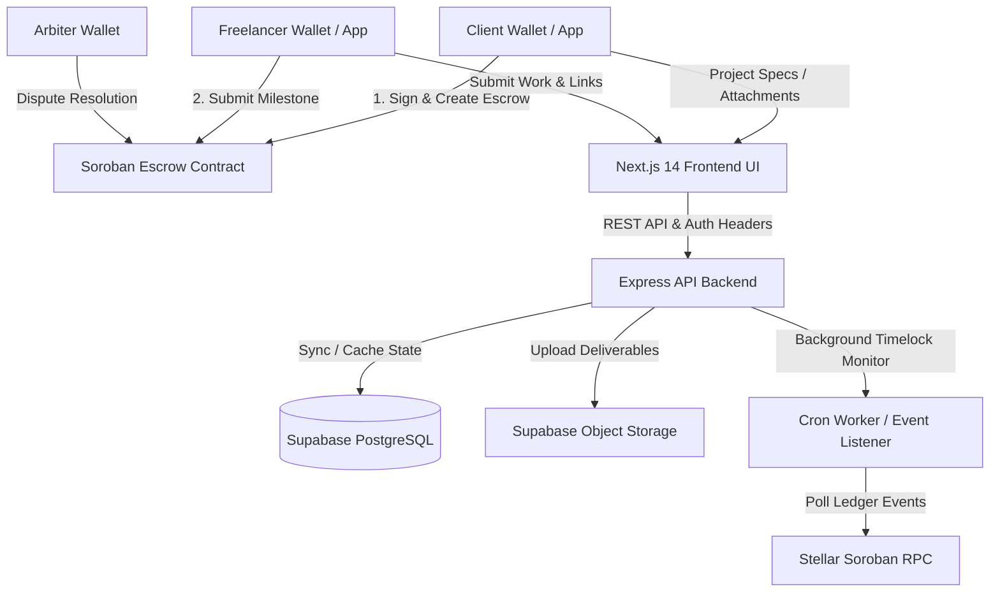
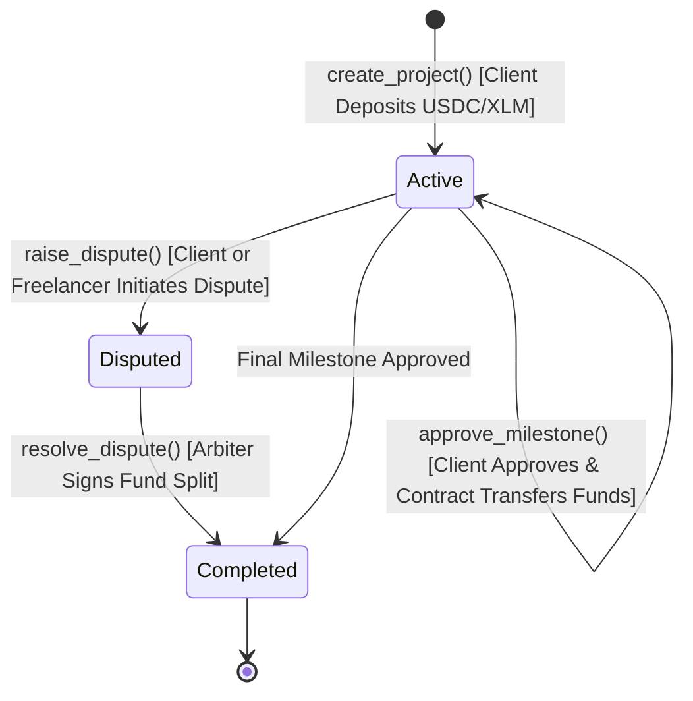
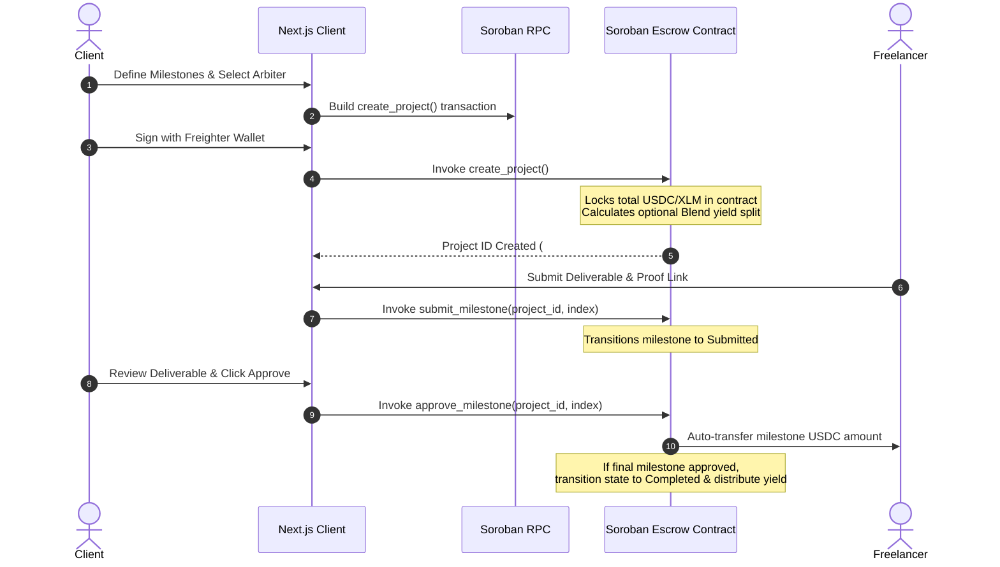
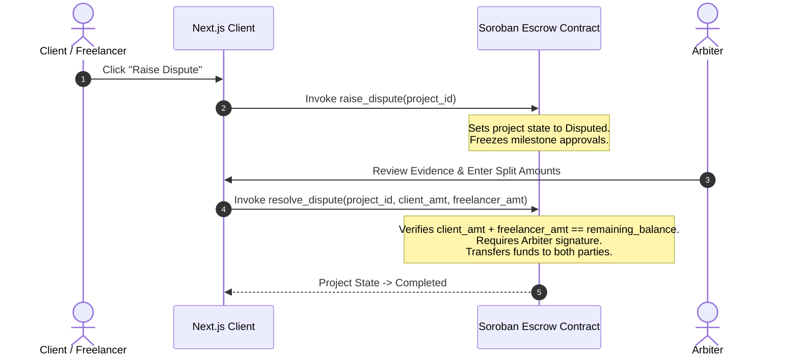

# TrustPay Escrow — System Architecture & Technical Specification 🏗️

TrustPay Escrow is a decentralized payment infrastructure designed to remove payment counterparty risk in client-freelancer agreements on the **Stellar Blockchain** using **Soroban smart contracts**.

---

## 1. High-Level Architecture Overview

TrustPay Escrow utilizes a **Hybrid On-Chain / Off-Chain Architecture**:
- **On-Chain (Soroban Smart Contracts):** Financial custody, milestone state progression, multi-sig authorization, dispute enforcement, and protocol yield allocation.
- **Off-Chain (Express API Backend & Supabase):** High-speed metadata indexing, proposal application workflows, file attachment storage, real-time push notifications, and timelock auto-release cron monitoring.

---

## 2. Soroban Smart Contract State Machine

The on-chain escrow contract manages projects through strict state transitions governed by cryptographic signatures:

### State Enum Definitions (`contracts/trustpay-escrow/src/lib.rs`)

1. **`ProjectState`**:
   - `Active`: Initialized state; funds locked; milestone work and payouts in progress.
   - `Disputed`: Frozen state; milestone claims paused until assigned arbiter resolves.
   - `Completed`: All milestones approved or final dispute split resolved; funds fully settled.

2. **`MilestoneState`**:
   - `Pending`: Milestone active; freelancer working on deliverable.
   - `Submitted`: Freelancer completed work; awaiting client approval or dispute window.
   - `Approved`: Client confirmed deliverable; milestone amount transferred to freelancer address.

---

## 3. Data Ownership & Single Source of Truth Matrix

To ensure security without sacrificing off-chain performance, data responsibilities are strictly demarcated:

| Domain Data | Storage Location | Authority | Security Mechanism |
|---|---|---|---|
| **Escrow Principal Balance** | Soroban Contract Storage | **Authoritative (On-Chain)** | Cryptographic Stellar SAC transfers |
| **Milestone Status & Amounts** | Soroban Contract Storage | **Authoritative (On-Chain)** | `Address::require_auth()` guard |
| **Project & Milestone State** | Soroban Contract Storage | **Authoritative (On-Chain)** | Enforced state machine transitions |
| **Proposal Cover Letters & Quotes** | Supabase Postgres DB | **Authoritative (Off-Chain)** | Zod schema validation & RLS |
| **Deliverable File Attachments** | Supabase Storage Buckets | **Authoritative (Off-Chain)** | Signed URL tokens & size limits |
| **Activity Event History** | Supabase DB / Indexer | Read-Only Cache | Polled from Stellar RPC logs |

---

## 4. Operational Workflows & Sequence Diagrams

### 4.1 Complete Escrow & Milestone Payout Sequence

### 4.2 Dispute Resolution Sequence

---

## 5. Yield Optimization Integration (Blend Protocol)

TrustPay Escrow supports optional capital efficiency via yield integration:
- **Principal Splitting:** When `yield_enabled = true` at project creation, 70% of locked escrow funds are deposited into liquid yield pools (e.g. Blend Lending Protocol on Stellar), while 30% remains in liquid reserve for early milestone payouts.
- **Yield Settlement:** Upon project completion, accumulated yield is accrued and divided between the client (70%) and platform reserve (30%), turning idle project capital into productive yield.

---

## 6. Technical Stack & Backend Module Architecture Taxonomy

- **Smart Contract Layer:** Rust, `soroban-sdk` v22.0.1, WebAssembly compilation (`wasm32-unknown-unknown`).
- **Backend API Service:** Express.js, Modular Feature Architecture (`modules/projects`, `modules/milestones`, `modules/proposals`, `modules/users`, `modules/notifications`, `modules/auto-release`, `shared/`), TypeScript 5, Node.js 20, Zod input validation, Winston logging.
- **Off-Chain Database & Storage:** Supabase (PostgreSQL), Supabase Object Storage, Row Level Security (RLS).
- **Frontend Client Application:** Next.js 14 (App Router), TypeScript, Tailwind CSS v4, `@stellar/freighter-api`, `@stellar/stellar-sdk`.
- **Infrastructure & Tools:** Docker, Docker Compose, GitHub Actions CI/CD, Soroban CLI.

