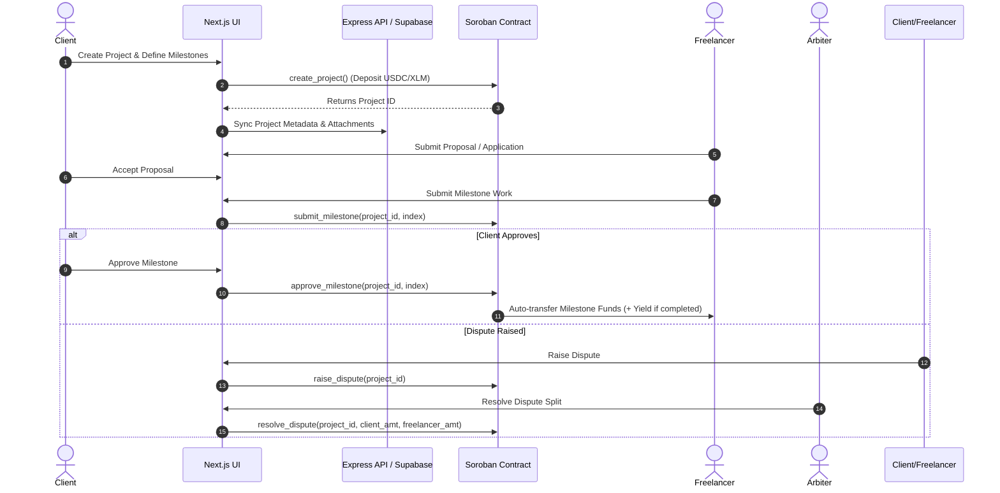

# TrustPay Escrow

**A Stellar-native milestone escrow and yield-optimizing payment platform for transparent, trustless gig economy settlement.**

---

## Overview

TrustPay Escrow is a decentralized payment infrastructure and web application built on the **Stellar blockchain** using **Soroban smart contracts**. It resolves the core trust dilemma inherent in client-freelancer relationships: clients hesitate to pay full amounts upfront, while freelancers risk non-payment after delivering work.

TrustPay Escrow solves this by locking funds in a non-custodial Soroban smart contract upon project initialization. Funds are automatically released milestone by milestone as work is submitted and approved. If disputes arise, a designated arbiter resolves the locked funds according to verifiable contract rules. Additionally, TrustPay Escrow integrates optional yield optimization protocols (such as Blend) to generate yield on escrowed balances while work is in progress.

> **Drip Wave Submission Note:** This repository contains the complete end-to-end product implementation for TrustPay Escrow on Stellar, including Soroban smart contracts, TypeScript SDK bindings, Express API services, Supabase database schemas, and a Next.js web client.

---

## Problem Statement

The global freelance and gig economy faces several systemic payment issues:

1. **Upfront Payment Risk for Clients:** Paying in advance leaves clients exposed to incomplete work, missed deadlines, or ghosting by contractors.
2. **Delivery Risk for Freelancers:** Delivering finished deliverables before payment subjects freelancers to chargeback risks, non-payment, and arbitrary fee cuts.
3. **High Intermediary Fees:** Traditional freelancing platforms charge between 10% and 20% in custody and service fees for basic escrow services.
4. **Lack of Payout Finality & Idle Capital:** Traditional escrow services hold funds in non-yielding bank accounts with slow cross-border clearing times and currency conversion surcharges.

---

## Solution

TrustPay Escrow leverages Stellar and Soroban smart contracts to create a low-cost, high-speed, milestone-based escrow network:

- **Non-Custodial Escrow:** Funds live inside the deployed Soroban smart contract—neither TrustPay nor any centralized party retains custody.
- **Milestone-Based Release:** Total project budgets are divided into milestones. As the freelancer submits each milestone, client approval triggers an instant on-chain transfer.
- **USDC & Multi-Asset Settlement:** Payments settle natively in USDC or XLM on Stellar with near-instant finality and minimal transaction fees.
- **Yield Optimization (Blend Protocol):** Escrowed principal can optionally earn yield via Stellar lending protocols, distributing earned yield between the client and platform upon completion.
- **Arbiter Dispute Path:** Disputed milestones freeze remaining contract funds until a designated arbiter signs off on a split settlement.

---

## Why This Project Matters

Payment settlement is a high-frequency, real-world utility use case. TrustPay Escrow moves everyday commercial transactions onto the Stellar network, replacing centralized payment processing with transparent smart contracts.

For the Stellar ecosystem, TrustPay Escrow:
- **Drives Recurring Transaction Volume:** Converts real-world freelancing activity into wallet interactions, asset transfers, and contract executions.
- **Increases Stablecoin Velocity:** Keeps native USDC circulating within productive economic agreements on Stellar.
- **Demonstrates Soroban Capability:** Showcases advanced Soroban features, including multi-party authorization, stateful milestone tracking, token transfers, and yield integration.

---

## Core Features

- **Soroban Milestone Escrow Contract:** Stateful logic written in Rust, compiled to WASM, enforcing project lifecycles (`Active`, `Disputed`, `Completed`).
- **Blend Yield Integration:** Optional yield generation splitting principal between liquid reserves and yield protocols.
- **Single-Identity Multi-Role Dashboards:** Toggle between **Client** and **Freelancer** roles within a single connected Stellar wallet.
- **Proposal & Application Management:** Freelancers apply with custom quotes; clients review, accept, or deny proposals with clean backend cleanup.
- **Project File Attachments:** Secure off-chain file uploads stored in Supabase with lightbox image previews.
- **Automated Timelocks & Notifications:** Express background cron jobs monitor milestone deadlines, auto-release inactive approvals, and send real-time user notifications.
- **On-Chain Dispute Arbitration:** Built-in dispute pathway for client or freelancer intervention with arbiter resolution logic.

---

## How It Works



### Detailed Workflow

1. **Project Initialization:** The Client creates a project, specifies milestone amounts, selects an arbiter, and calls `create_project` on the Soroban contract. Total funds are locked in escrow.
2. **Proposal Acceptance:** Freelancers apply with proposals. Upon Client acceptance, the Freelancer address is bound to the on-chain project.
3. **Milestone Submission:** Upon completing work, the Freelancer calls `submit_milestone`.
4. **Approval & Release:** The Client reviews and calls `approve_milestone`. The contract immediately transfers the milestone funds to the Freelancer.
5. **Completion & Yield Distribution:** When the final milestone is approved, the project state transitions to `Completed`. If yield optimization was enabled, accumulated yield is calculated and distributed according to protocol parameters (70% Client / 30% Platform).

---

## Stellar Ecosystem Alignment

TrustPay Escrow is built specifically for the Stellar network:

- **Fast Finality:** 3-5 second ledger settlement ensures freelancers receive funds instantly upon approval.
- **Ultra-Low Transaction Costs:** Contract invocations and payment releases cost fractions of a cent.
- **Native USDC Integration:** Eliminates currency volatility by settling contracts in Stellar-native USDC.
- **Freighter Wallet Support:** Seamless transaction signing via standard web3 Stellar browser extensions.

---

## Specific Benefits to the Stellar Blockchain

### Increased Network Utility
TrustPay Escrow creates sustained on-chain activity by anchoring real-world freelance agreements to Stellar contracts and token balances.

### Adoption Driver for Web2 & Web3 Workers
By offering a intuitive user interface and wallet login, TrustPay Escrow serves as an onboarding ramp for freelancers and companies entering the Stellar ecosystem.

### Strategic Ecosystem Value
The Soroban escrow contract serves as a foundational open-source primitive that can be reused for trade finance, marketplace checkouts, grant distribution, and gig economy platforms across Stellar.

---

## Technical Architecture

TrustPay Escrow uses a hybrid architecture designed to maintain financial invariants on-chain while keeping user metadata responsive off-chain.

| Layer | Component | Technology | Responsibility |
|---|---|---|---|
| **Smart Contract** | `contracts/trustpay-escrow` | Rust, `soroban-sdk` | Custody of escrowed funds, milestone state transitions, dispute enforcement, yield distribution |
| **Frontend UI** | `frontend` | Next.js 14, TypeScript, Tailwind CSS | Wallet connectivity (`@stellar/freighter-api`), role-based dashboards, project workspace |
| **Backend API** | `backend` | Node.js, Express, TypeScript, Zod | Proposal validation, file uploads, auto-release cron jobs, Supabase sync |
| **Database** | `supabase` | Supabase (PostgreSQL) | Off-chain metadata, persistent proposals, attachments, activity notifications |

### Single Source of Truth Matrix

| Operation | On-Chain (Soroban) | Off-Chain (Supabase / Express) |
|---|---|---|
| Fund Deposit & Custody | **Authoritative (Smart Contract)** | Read-only cache |
| Milestone Status | **Authoritative (Smart Contract)** | Synced state |
| Project Description & Files | N/A | **Authoritative (Supabase Storage)** |
| Proposals & Applications | N/A | **Authoritative (Postgres DB)** |
| Payout Execution | **Authoritative (Token Transfer)** | Notification log |

---

## Project Structure

```
trustpay-escrow/
├── Cargo.toml                      # Workspace manifest
├── contracts/                      # Soroban Smart Contracts
│   └── trustpay-escrow/
│       ├── src/
│       │   ├── lib.rs              # Main Soroban contract logic & yield integration
│       │   └── test.rs             # Rust unit & integration tests
│       ├── Cargo.toml
│       └── Makefile
├── frontend/                       # Next.js Web Client
│   ├── src/
│   │   ├── app/                    # Next.js App Router (Dashboard, Projects, Workspace)
│   │   ├── components/             # Role dashboards, lightboxes, modals
│   │   ├── hooks/                  # Custom React hooks for Stellar & contract calls
│   │   ├── lib/                    # Stellar SDK bindings & API client
│   │   └── store/                  # Zustand wallet & role persistence store
│   ├── package.json
│   └── tsconfig.json
├── backend/                        # Express API & Cron Service
│   ├── src/
│   │   ├── controllers/            # User, project, proposal, and milestone controllers
│   │   ├── routes/                 # REST endpoints
│   │   ├── services/               # Supabase & cron services
│   │   └── server.ts               # Express entry point
│   ├── package.json
│   └── tsconfig.json
└── supabase/                       # Database Schema & Migrations
    └── migrations/
        ├── 0000_initial_schema.sql
        ├── 0002_multi_role_capabilities.sql
        ├── 0003_project_files.sql
        ├── 0004_proposals_table.sql
        ├── 0005_notifications_table.sql
        ├── 0006_auto_release_timelock.sql
        ├── 0007_timelock_reminders.sql
        ├── 0008_multi_token_support.sql
        └── 0009_yield_feature.sql
```

---

## Smart Contract Function Matrix

The Soroban contract (`contracts/trustpay-escrow/src/lib.rs`) exposes the following methods:

| Method | Access | Description |
|---|---|---|
| `create_project` | Client | Locks project total in escrow, creates milestones, and calculates yield reserves if enabled. |
| `get_project` | Public | Returns complete `Project` struct including milestone states and accrued yield. |
| `submit_milestone` | Freelancer | Updates milestone state from `Pending` to `Submitted`. |
| `approve_milestone` | Client | Marks milestone `Approved`, transfers milestone funds to freelancer, and triggers final yield payout if all milestones complete. |
| `raise_dispute` | Client / Freelancer | Freezes active project funds and transitions project state to `Disputed`. |
| `resolve_dispute` | Arbiter | Distributes locked funds according to arbiter split parameters and closes the project. |
| `accrue_yield` | System / Admin | Updates internal yield balance tracking for active yield-enabled projects. |

---

## Database Migrations Summary

The Supabase database tracks off-chain metadata across 9 structured migrations:

- `0000_initial_schema.sql`: Primary `users`, `projects`, and `milestones` tables.
- `0002_multi_role_capabilities.sql`: Adds `is_client` and `is_freelancer` flags to support unified identity logins.
- `0003_project_files.sql`: Stores uploaded attachment metadata and storage paths.
- `0004_proposals_table.sql`: Manages freelancer applications and proposal acceptance states.
- `0005_notifications_table.sql`: Stores activity events for user notifications.
- `0006_auto_release_timelock.sql`: Supports automated milestone release countdowns.
- `0007_timelock_reminders.sql`: Tracks automated reminder dispatch state.
- `0008_multi_token_support.sql`: Enables multi-token asset selection for escrow settlement.
- `0009_yield_feature.sql`: Persists yield settings and accrued interest metrics.

---

## Getting Started

### Prerequisites

- [Rust](https://www.rust-lang.org/) with target `wasm32v1-none`
- [Stellar CLI](https://developers.stellar.org/docs/build/smart-contracts/getting-started/setup)
- [Node.js](https://nodejs.org/) (v18+ recommended)
- [Freighter Wallet Extension](https://www.freighter.app/)

### 1. Smart Contract Build & Deployment

```bash
# Navigate to the contract directory
cd contracts/trustpay-escrow

# Run unit tests
cargo test

# Build WASM binary
stellar contract build

# Deploy contract to Stellar Testnet
stellar contract deploy \
  --wasm target/wasm32v1-none/release/trustpay_escrow.wasm \
  --source <your-funded-identity> \
  --network testnet
```

### 2. Backend API Setup

```bash
cd backend

# Install dependencies
npm install

# Configure environment variables
cp .env.example .env
# Edit .env with your Supabase credentials & contract ID

# Start Express development server
npm run dev
```

### 3. Frontend Web Client Setup

```bash
cd frontend

# Install dependencies
npm install

# Start Next.js development server
npm run dev
```

Open [http://localhost:3000](http://localhost:3000) in your browser with the Freighter extension installed.

---

## Roadmap

- [x] Soroban smart contract milestone logic on Stellar Testnet
- [x] Supabase database migrations & Express REST API
- [x] Next.js frontend with Freighter wallet integration & single-identity role switching
- [x] Freelancer proposal submissions & client acceptance flow
- [x] Yield optimization parameter tracking (Blend protocol integration)
- [ ] On-chain ledger timestamp auto-release enforcement
- [ ] Contract security audit & mainnet deployment

---

## License

This project is open source and available under the [MIT License](LICENSE).